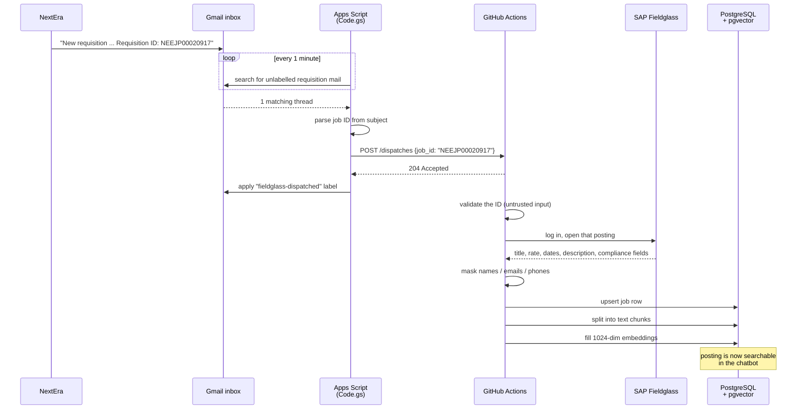

# How a NextEra job posting reaches our database

A walkthrough of the job-intake pipeline for anyone joining the project. It
covers what each moving part does, why it was built that way, and how to tell
whether it is working.

**In one sentence:** when NextEra emails us a new requisition, a script inside
Gmail tells GitHub to run our Playwright scraper, which logs into Fieldglass,
pulls that posting, strips personal data, stores it, and makes it searchable —
about a minute after the email lands, with nobody involved.

---

## The two paths

Every posting reaches the database by one of two routes. They share all the same
machinery downstream; only the trigger differs.

| | **Email trigger** | **Scheduled scrape** |
| --- | --- | --- |
| Starts when | A requisition email arrives | Every ~30 minutes, always |
| Scrapes | Just the posting(s) named in the email | Any posting not already stored |
| Speed | ~1 minute from email to searchable | Up to 30 minutes |
| Role | The fast path | The safety net |

The scheduled scrape is what makes the fast path safe to build. If the email is
never sent, arrives malformed, or the posting is not yet published in Fieldglass
when we look, nothing is lost — the next scheduled pass collects it. Every
design decision in the fast path leans on that backstop.

---

## End to end



Measured end to end on 24 Aug 2026: **48 seconds** from dispatch to a completed
run, and **91 seconds** to a chunk being embedded and searchable.

---

## Part 1 — `Code.gs`, the Gmail watcher

**Where it lives:** [script.google.com](https://script.google.com), in a project
owned by the mailbox that receives the requisition emails. Version-controlled
copy: [`scripts/apps-script/requisition-dispatch.gs`](../scripts/apps-script/requisition-dispatch.gs).

**Why it exists at all.** GitHub Actions cannot listen for email — it can only
run on a schedule or be pushed to from outside. Polling Gmail from a scheduled
workflow would mean a job starting every few minutes whether or not any mail
arrived. Apps Script runs the poll on Google's infrastructure for free, so
GitHub only wakes up when there is genuinely something to scrape.

**Why there is no password anywhere.** The script runs *inside* the mailbox's
own Google account, so there is nothing to log into. Authorisation is a one-time
OAuth consent when `setup()` is first run. No Gmail credential exists in the
repo, in GitHub, or in anyone's `.env`.

**What one tick does:**

1. Search Gmail for requisition mail that has not been handled yet
2. Pull the Fieldglass job ID out of each subject (body as fallback)
3. Send **one** dispatch to GitHub carrying every ID found
4. Label those threads so they never fire again

The search itself is the whole of the logic:

```
subject:("new requisition" "submitted")
from:nextera@vdartinc.com
newer_than:2d
-label:fieldglass-dispatched
```

**Why the label matters more than it looks.** That last line is the entire state
of the system. There is no "last processed" record, no watermark, no database of
seen emails. An email without the label is unprocessed by definition, and the
label is applied **only after GitHub returns 204**. So if a dispatch fails, the
thread stays unlabelled and the next tick retries it. Nothing needs to remember
where it got to.

**Why a cluster becomes one dispatch.** Requisitions sometimes arrive in
batches. One dispatch per email would create several workflow runs at once, and
because they share a concurrency group (see Part 3), GitHub would cancel most of
them. So the script collects every ID in a tick and sends them together as
`"NEEJP1,NEEJP2,NEEJP3"` — one run, one Fieldglass login, nothing cancelled.

Two rails: at most 10 threads per tick, and the mail search only looks back two
days.

---

## Part 2 — `repository_dispatch`, the handoff

This is GitHub's mechanism for letting an outside system start a workflow. Apps
Script sends:

```json
POST /repos/richards-lgtm/recruitment-ai-platform/dispatches
{
  "event_type": "new-requisition",
  "client_payload": { "job_id": "NEEJP00020917" }
}
```

GitHub replies `204 No Content` and starts any workflow listening for that
`event_type`. Authentication is a fine-grained token with **Contents: write** on
this one repository, stored in the Apps Script project's Script Properties.

**Two things that catch people out:**

- `repository_dispatch` only ever runs the workflow **as it exists on the
  default branch**. Dispatching against a feature branch does nothing at all —
  no run, no error, no clue.
- `204` means *GitHub accepted the request*, not *the scrape worked*. Those are
  separate questions with separate places to check.

---

## Part 3 — The workflow

[`.github/workflows/requisition-trigger.yml`](../.github/workflows/requisition-trigger.yml)

**Step 1 — validate the IDs.** The payload arrives from outside the repository,
so it is treated as untrusted. Each ID is normalised and checked against the
Fieldglass shape (`^[A-Z0-9_-]{3,40}$`); anything else fails the run. The value
is read through an environment variable and never pasted into a shell command,
because a payload like `NEEJP1; rm -rf /` would otherwise execute on the runner.
Duplicates are dropped, and more than 25 IDs in one dispatch is refused as a
runaway guard.

**Step 2 — scrape.** Runs the Playwright spec in targeted mode with all the IDs
at once, so a cluster costs one Fieldglass login rather than one each.

**Step 3 — chunk and embed.** Covered in Part 5.

**Why the workflow serialises with the scheduled scrape.** Both share a
concurrency group, so two Fieldglass sessions never run at once — the same
account logging in twice can invalidate its own session. The cost is that a
second run waits; the batching in Part 1 is what keeps that from becoming a
problem.

**The retry, and why it is a warning rather than a failure.** The notification
email regularly beats the Fieldglass UI by a few minutes, so a posting we were
just told about may not be listed yet. The spec prints `TARGET_NOT_FOUND` for
those, and the workflow waits three minutes and retries **only** the missing
IDs. If they are still absent it emits a warning and leaves them to the
scheduled scrape. A red build there would cry wolf on a routine race.

A genuine failure — bad login, database down — is a different thing and does
fail the run properly.

---

## Part 4 — The Playwright scrape

[`tests/fieldglass-scrape.spec.ts`](../tests/fieldglass-scrape.spec.ts)

Fieldglass has an API, but we have no access to it, so the bot drives the portal
the way a person would: log in, open *Job Posting – Respond*, read the work
items list, visit detail pages.

**Two modes, one spec:**

- **Targeted** (`FIELDGLASS_JOB_IDS` set) — visit exactly these postings, even
  if already stored. This is what the email trigger uses.
- **Incremental** (the default) — compare the portal list against stored job
  IDs; visit detail pages only for postings we have never seen, refresh the
  timestamp on the rest, and mark anything that has disappeared as closed. This
  is what the scheduled scrape uses, and it is why a 30-minute cadence is cheap.

**Personal data never reaches the database.** [`utils/maskJobs.ts`](../utils/maskJobs.ts)
runs before any insert: coordinator and distributor names are replaced, and
those same names, plus email addresses and phone numbers, are scrubbed from all
free text. The unmasked JSON exists only in a local `output/` folder that is
never uploaded anywhere.

*Known gap:* a person's name that appears **only** in free prose, never in a
structured contact field, cannot be caught by pattern matching. Closing it needs
a name-recognition pass.

**What gets stored.** One row per posting in `jobs`, keyed on the Fieldglass job
ID. Alongside the obvious fields, twelve more are promoted out of the raw field
map into real columns — shift type, total hours, driving required, nuclear badge
access, NERC CIP access and so on — following a field review with the client.
The complete raw label/value map is kept as JSON regardless, so a field we
decided to skip can be promoted later without re-scraping anything.

---

## Part 5 — Chunk and embed

A stored posting is not yet a *findable* posting. Two more steps make it
searchable:

1. **Chunk** — split the posting into a few text passages: a one-line summary,
   the description, and any extra buyer notes. Boilerplate that is identical
   across every posting (furlough policy, driving-record text) is deliberately
   excluded — it carries no signal and would pollute results.
2. **Embed** — turn each chunk into a 1024-number vector using the BGE-M3 model,
   so the chatbot can find postings by meaning rather than exact wording.

Both run automatically after every scrape, via a shared action used by both
workflows. That automation is recent, and it exists because of a real incident:
chunking used to be a manual command, and by the time anyone checked, **215
chunks across 85 postings had never been embedded — 33 of them open roles that
were completely invisible to the chatbot** while every dashboard looked healthy.

**How the queue works.** A chunk with no vector *is* the to-do list. If
embedding fails, the chunks stay queued and the next run picks them up, so a
transient outage self-heals rather than needing anyone to notice.

---

## Nothing remembers anything

Worth stating plainly, because it is the idea that makes the whole pipeline
robust on throwaway infrastructure:

| Question | Where the answer lives |
| --- | --- |
| Has this email been handled? | The Gmail label |
| Do we already have this posting? | The `jobs` table, keyed on job ID |
| Is this posting still open? | Whether it appeared in the last portal listing |
| Which chunks still need embedding? | The chunks whose vector is empty |

There is no state file, no watermark, no counter — which is what allows every
run to happen on a fresh machine that is destroyed afterwards. It also means
duplicates are harmless: scraping the same posting twice just refreshes the row.

---

## Where everything lives

| Piece | Runs on | Configured with |
| --- | --- | --- |
| Gmail watcher | Google (Apps Script) | Script Properties (`GITHUB_TOKEN`) |
| Workflows | GitHub-hosted runner | Repository secrets |
| Scraper | Same runner, headless Chromium | Fieldglass credentials |
| Database | Supabase (development) | `DATABASE_URL` |
| Embedding model | Modal (GPU, scales to zero) | `EMBED_SERVICE_URL` + token |
| Chatbot | Modal | Its own config secret |

**Governance:** this is a development setup. NextEra job data was agreed to stay
inside VDart's network, and the cloud services above are a documented exception
pending manager sign-off. Masking runs before anything leaves the machine, and
raw scraped files are never uploaded.

---

## Checking that it works

**Did the email trigger fire?**
Apps Script → *Executions*. Ticks run every minute; the interesting ones log
`Dispatched N requisition(s)`. Quiet ticks completing in under a second are the
normal state, not a fault.

**Did GitHub run?**
Actions tab → *Requisition email trigger*.

**Did it reach the database?**
The posting's `last_seen_at` moves, and its chunks gain embeddings.

**Is anything stuck?**
Chunks with an empty vector should return to zero after each scrape.

---

## When something breaks

| Symptom | Most likely cause |
| --- | --- |
| No dispatches, but mail is arriving | Search terms no longer match the email format — run `dryRun()` to see what matches |
| Apps Script logs "Dispatch failed" repeatedly | GitHub token expired or was revoked |
| `204` accepted but no workflow run | Workflow file is not on the default branch, or the event name does not match |
| Scrape fails at the database step | Database password rotated without updating the secret |
| Run warns "not visible in Fieldglass" | Normal — the email beat the portal; the scheduled scrape will collect it |
| Chunks stay unembedded | Embedding service unreachable; next run retries automatically |
| Portal steps fail after a Fieldglass redesign | Selectors need re-checking against the live site |

---

## Known limits

- **The scraper depends on Fieldglass's HTML.** No API access, so a portal
  redesign means updating selectors. Nothing about this is avoidable today.
- **Free-prose names are not masked.** Documented above; needs a
  name-recognition pass to close.
- **The Gmail watcher is tied to one person's account.** If that account is ever
  suspended, the trigger stops. A shared mailbox would remove that dependency.
- **The GitHub token expires** and must be renewed, or the trigger stops
  silently.
- **Nothing watches for silent drift.** The chunking incident was found by
  chance. An alert when open postings have no chunks would turn the next such
  problem from invisible into obvious.

---

*Pipeline verified working end to end on 24 August 2026: 141 postings stored,
62 open, 353 chunks all embedded.*
